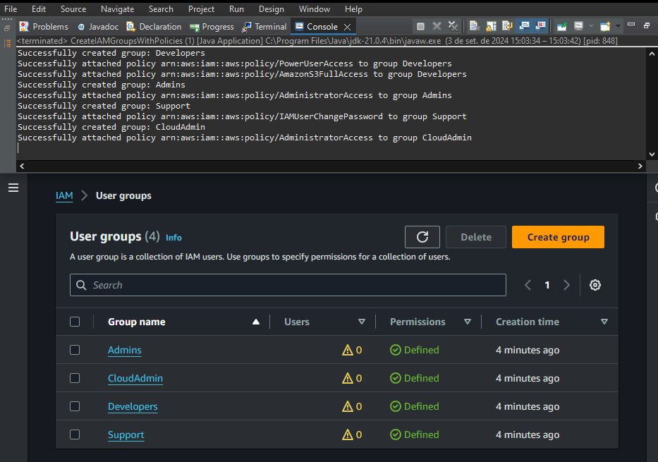
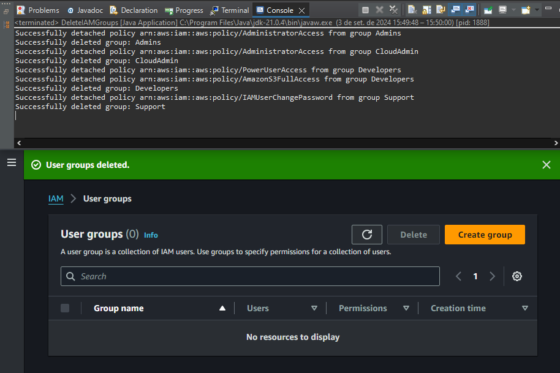

# AWS IAM Group Management With Java

This repository automates creating and deleting AWS IAM Groups with AWS SDK for Java 2.x.

---

## Overview
This project contains two main classes:

- `CreateIAMGroupsWithPolicies`: Automates creating IAM groups and attaching predefined policies.
- `DeleteIAMGroups`: Deletes all IAM groups in your AWS account.

---

## Requirements

- Java 1.8+
- AWS CLI

---

## Usage

#### 1. Clone the repository:
   - Download or clone the repository to your local environment.

#### 2. Open the project:
   - Open the project in your preferred IDE such as Eclipse or IntelliJ.

#### 3. Customize the Code:
   - Modify the group names and policies in the `CreateIAMGroupsWithPolicies` class to suit your needs.
  
For example:
```java
// Specify the names of the groups to create.
String[] groupNames = { "Developers", "Admins", "Support", "CloudAdmin" };

// Define the policies to attach to each group.
String[][] groupPolicies = {
    { "arn:aws:iam::aws:policy/PowerUserAccess", "arn:aws:iam::aws:policy/AmazonS3FullAccess" }, 
    // Policies for Developers
    { "arn:aws:iam::aws:policy/AdministratorAccess" }, 
    // Policies for Admins
    { "arn:aws:iam::aws:policy/IAMUserChangePassword" }, 
    // Policies for Support
    { "arn:aws:iam::aws:policy/AdministratorAccess" } 
    // Policies for CloudAdmin
};
```

#### 4. Run the classes:
   - `CreateIAMGroupsWithPolicies`: Run this class to create IAM groups and assign specified policies to each.
   - `DeleteIAMGroups`: Run this class to delete all IAM groups from your AWS account.

---

#### Group created


#### Group deleted 

